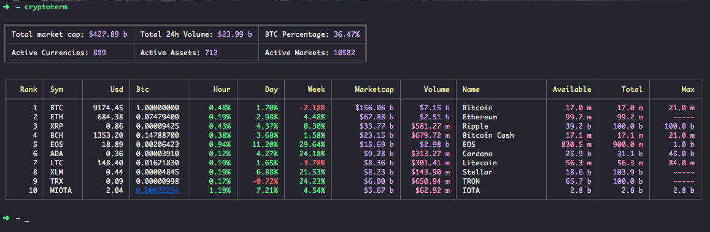

# cryptoterm

> Cryptocurrency data command line interface. Data from Coinmarketcap API



Install this globally and you'll have access to the `cryptoterm` command anywhere on your system.

```shell
npm install -g cryptoterm
```
# Installation
Install this globally and you'll have access to the `cryptoterm` command anywhere on your system.

```shell
npm install -g cryptoterm
```

# Usage

## List cryptos
To get a list of the top 10 cryptocurrencies just type:

```bash
cryptoterm
```

To determine the length of the list add **-l** and the number of rows, for eg. **30**

```bash
cryptoterm -l 30
```

## Check specific crypto
Let's say you're looking for the latest Bitcoin data:

```bash
cryptoterm -t bitcoin
```
